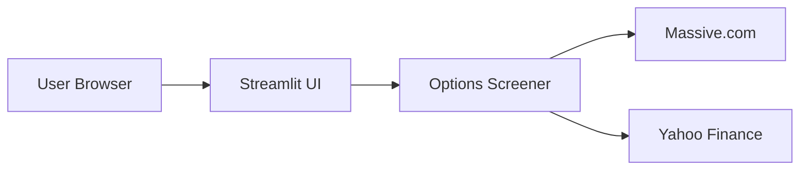
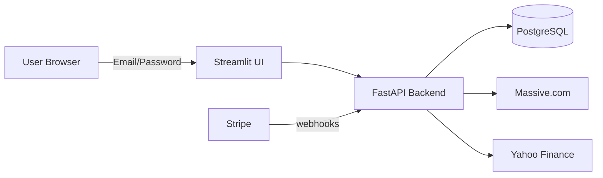

# Put Options Screener

Interactive Streamlit app that scans put option chains for a list of stocks, computes key metrics (delta, annualized return, implied volatility), and highlights candidates that meet your custom filters. Data comes from Massive.com (professional Greeks) with Yahoo Finance as a fallback.

## Features

- **Professional-grade Greeks**: Delta, gamma, theta, vega directly from Massive.com API
- **Automatic fallback**: Uses Yahoo Finance when Massive.com data is unavailable
- **Responsive UI**: Works on desktop and mobile browsers
- **Real-time news**: Latest news headlines for screened tickers
- **Configurable filters**: DTE, volume, open interest, return %, assignment probability

## Quick Start (Local Development)

### Prerequisites
- Python 3.11+
- Massive.com API key (https://massive.com)

### Setup

1. Clone the repo
```bash
git clone https://github.com/your-org/PutOptionsTrading.git
cd PutOptionsTrading
```

2. Create and activate a virtual environment
```bash
python -m venv .venv
source .venv/bin/activate  # Windows: .venv\Scripts\activate
```

3. Install dependencies
```bash
pip install -r requirements.txt
```

4. Create a `.env` file with your API key:
```bash
MASSIVE_API_KEY=your_massive_api_key
```

5. Run the app
```bash
streamlit run app.py
```

## Project Structure

```
PutOptionsTrading/
├── app.py                 # Streamlit UI (supports local + SaaS modes)
├── options_screener.py    # Core screening logic
├── massive_api_client.py  # Massive.com API client
├── config.json           # Default settings
├── requirements.txt      # Frontend dependencies
├── backend/              # FastAPI backend (for SaaS deployment)
│   ├── main.py          # API endpoints
│   ├── requirements.txt # Backend dependencies
│   └── Procfile         # Railway start command
├── DEPLOY.md            # Step-by-step deployment guide
└── railway.json         # Railway configuration
```

## Configuration

Edit `config.json` or use the sidebar in the UI:

| Setting | Description | Default |
|---------|-------------|---------|
| `max_dte` | Maximum days to expiration | 45 |
| `min_dte` | Minimum days to expiration | 15 |
| `min_volume` | Minimum option volume | 10 |
| `min_open_interest` | Minimum open interest | 10 |
| `min_annualized_return` | Minimum return % | 20 |
| `max_assignment_probability` | Max probability (delta) % | 20 |

## Architecture

The application supports two modes: **Local** (for development) and **SaaS** (for production deployment).

### Local Mode Architecture



In local mode, the Streamlit app directly calls the Massive.com API for options data and Greeks, with Yahoo Finance as a fallback when Massive.com data is unavailable.

### SaaS Mode Architecture



In SaaS mode:
- **Email/Password Authentication** with JWT tokens
- **FastAPI Backend** manages user sessions, usage limits, and API calls
- **PostgreSQL** stores user data, settings, and subscription status
- **Stripe** processes subscription payments via webhooks

## Deploying as a Paid SaaS

This app is ready to deploy as a paid subscription service with:
- **Email/Password Auth**: Simple, built-in authentication with JWT
- **Stripe**: Subscription billing ($9.99/mo Pro plan)
- **Railway**: Hosting (~$15/mo)
- **PostgreSQL**: User and settings management

See **[DEPLOY.md](DEPLOY.md)** for step-by-step instructions.

### Subscription Tiers

| Tier | Price | Limits |
|------|-------|--------|
| Free | $0 | 5 screens/day, 5 symbols max |
| Pro | $9.99/mo | Unlimited screens, 50 symbols |

## Data Sources

- **Massive.com** (Primary): Professional Greeks from API - no local calculation
- **Yahoo Finance** (Fallback): Free data, Greeks calculated locally via Black-Scholes

## API Endpoints (Backend)

| Endpoint | Method | Auth | Description |
|----------|--------|------|-------------|
| `/health` | GET | No | Health check |
| `/auth/signup` | POST | No | Create new account |
| `/auth/login` | POST | No | Login with email/password |
| `/api/v1/me` | GET | Yes | Current user info + settings |
| `/api/v1/settings` | GET | Yes | Get user settings |
| `/api/v1/settings` | PUT | Yes | Update user settings |
| `/api/v1/screen` | POST | Yes | Run screener |
| `/api/v1/news/{symbol}` | GET | No | Get ticker news |
| `/api/v1/checkout` | POST | Yes | Create Stripe checkout |
| `/webhooks/stripe` | POST | No | Stripe webhook handler |

## Development

### Running Backend Locally
```bash
cd backend
pip install -r requirements.txt
uvicorn main:app --reload
```

### Running Frontend with Backend
```bash
# Set environment variable to point to backend
export API_URL=http://localhost:8000
streamlit run app.py
```

## Security Notes

- Keep API keys in environment variables or `.env`
- Never commit secrets to version control
- In production, restrict CORS to your frontend domain

## License

MIT
