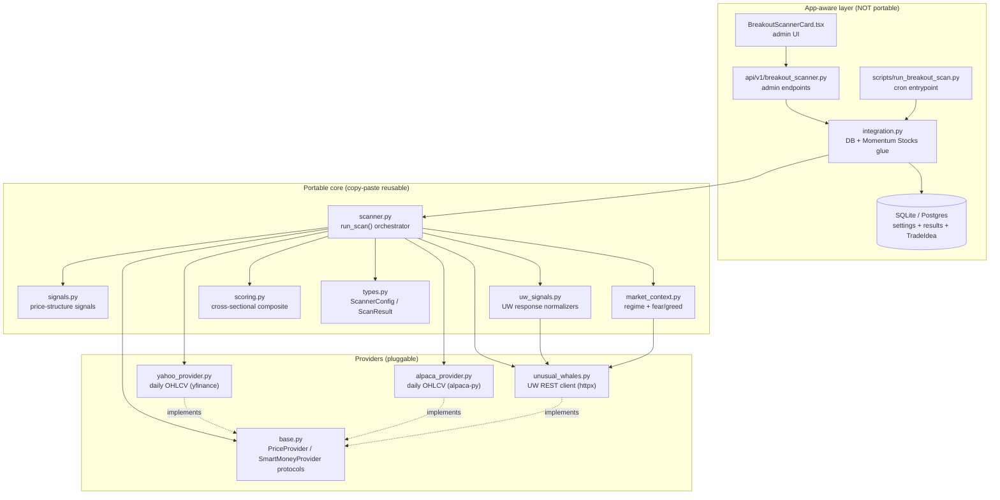
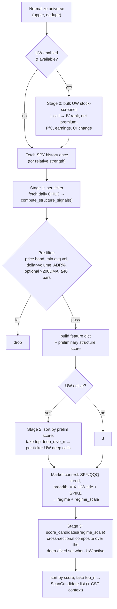
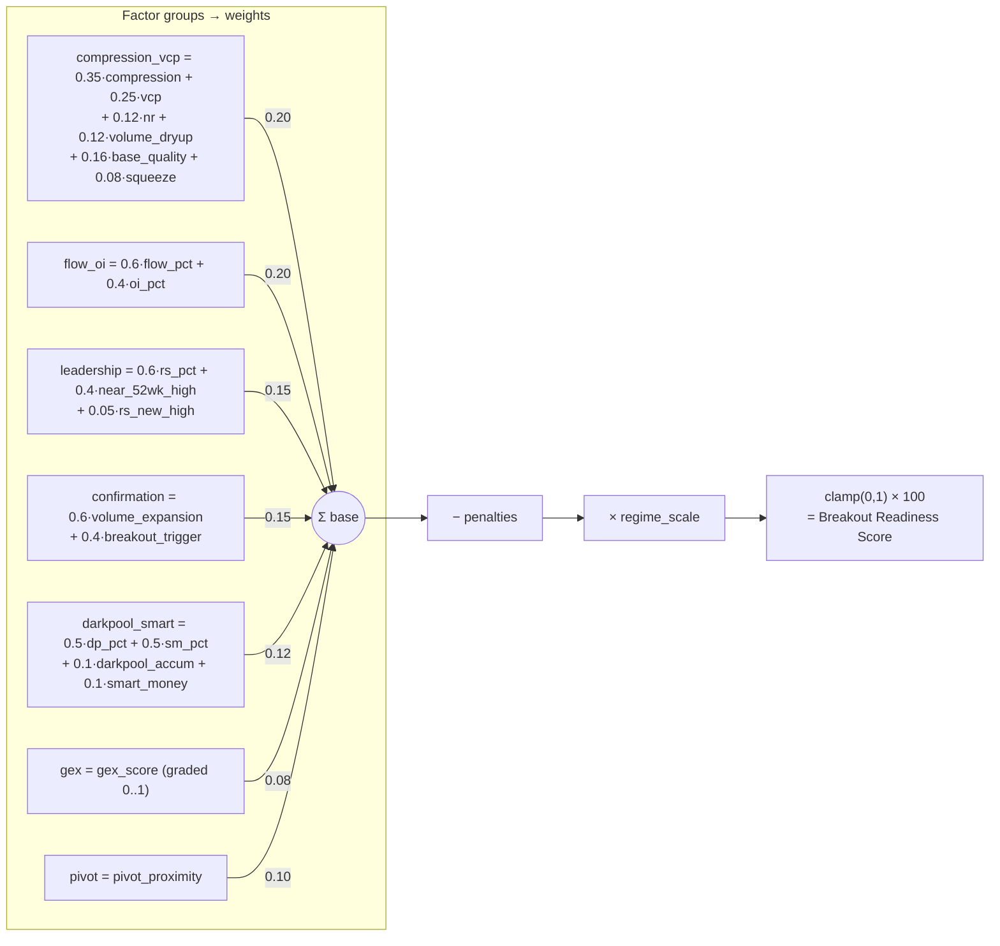
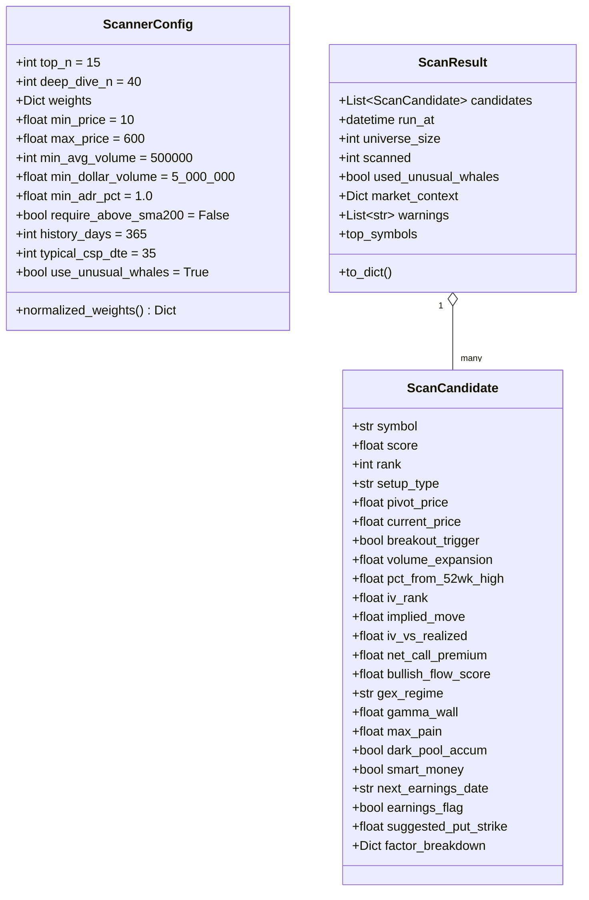
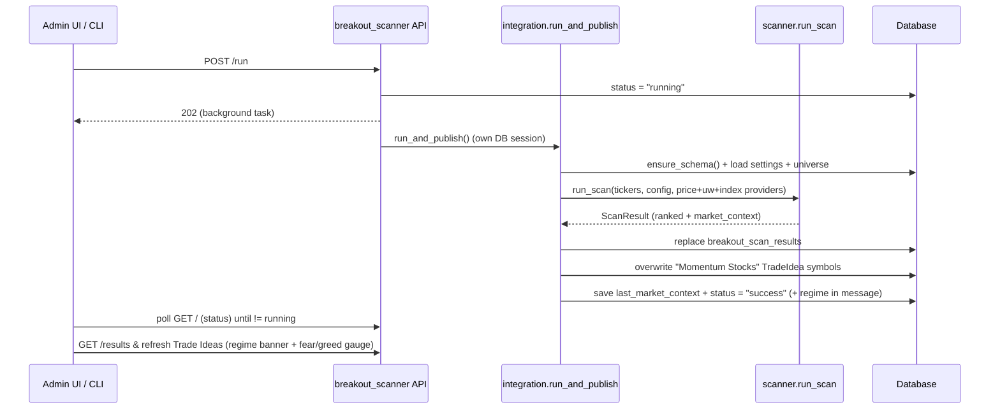
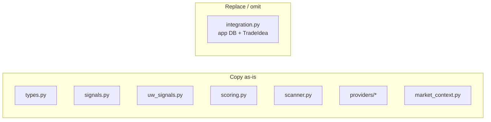
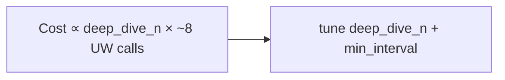

# Breakout Scanner — Architecture & Algorithm

This document explains **how the momentum / breakout scanner works**, **how to reuse it** in
other projects, and serves as **context for future feature work**. For a short usage
overview see `README.md`; this file is the deep reference.

---

## 1. Purpose

Rank a user-defined universe of tickers by a **0–100 Breakout Readiness Score** that
estimates how likely a stock is to break out *soon* (not one already extended). The top
picks are published as the **"Momentum Stocks"** trade idea, primarily to support
**cash-secured put (CSP)** selling on quality names poised to move up.

Design tenets:

- **Leading indicators + confirmation.** Volatility compression, contraction, relative
  strength, pivot proximity, and smart-money options flow identify *coiling* names; a
  dedicated **breakout-confirmation** group (volume expansion + a confirmed pivot break)
  separates "watch" setups from "go" setups. Never lagging triggers (MACD, SMA-cross,
  raw RSI level).
- **Regime-aware.** A market-context layer (`market_context.py`) condenses the broad tape
  into a 0–100 fear/greed score and a `regime_scale` multiplier so the same setup ranks
  lower in a risk-off tape than a risk-on one. We don't fight the market.
- **Portable core.** Everything except `integration.py` has no app dependencies and can
  be lifted into another project.
- **Graceful degradation.** If Unusual Whales (UW) is unavailable, the scan still runs on
  price structure alone and the UW factor weights are redistributed. Every external input
  (UW endpoint, VIX, index series) degrades to neutral rather than aborting the scan.
- **Transparent scoring.** Every candidate carries a `factor_breakdown` (incl. the applied
  `regime_scale`) so a score can be explained.

---

## 2. Component architecture



**Dependency rule:** arrows point "downward" only. The core depends on protocols, never on
the app. `integration.py` is the single bridge between the app and the core.

---

## 3. The algorithm

### 3.1 Pipeline (what `run_scan` does)



**Why two UW stages?** Stage 0 is **one cheap bulk call** for the whole universe. Stage 2
is **expensive per-ticker** (multi-day flow, per-strike GEX, max-pain, option-contracts OI,
dark pool, insider, congress, seasonality ≈ 8 calls each), so it only runs for the
strongest `deep_dive_n` structures — this bounds API cost and rate-limit exposure.

**Deep-dive-aware ranking.** When UW is active, only the deep-dived survivors (which have
full smart-money data) are ranked against each other in Stage 3, so a structurally-zeroed
name can never outrank one with real flow/GEX/dark-pool data.

### 3.2 Price-structure signals (`signals.py`)

All pure NumPy; each returns 0..1 unless noted. Computed in
`compute_structure_signals(ohlc, spy_closes)` (requires ≥ 40 bars).

| Signal | Function | Idea | Output |
|--------|----------|------|--------|
| Volatility compression | `bollinger_compression` | Bollinger bandwidth `(2·2σ)/mean`, period 20, over 126-day lookback. Lower current bandwidth vs its own history = coiled spring. | `compression = 1 − percentile`; `squeeze` bool if `bw < 0.75·mean(hist)` or `pctl < 0.15` |
| Range tightness | `nr_tightness` | Avg range of last 7 bars vs prior 30 (NR7 / inside-bar family). | `clip(1.2 − recent/prior)` |
| VCP contraction | `vcp_contraction` | 4 segments × 10 bars; reward monotonically shrinking ranges + tightness of most-recent vs oldest. | 0..1 |
| Volume dry-up | `volume_dryup` | 5-day vs 20-day avg volume; sellers exhausted into the base. | `clip(1.2 − vol5/vol20)` |
| **Volume expansion** | `volume_expansion` | Last-day volume vs 50-day avg — breakout *confirmation* (the opposite of dry-up). | `ratio` + 0..1 score (2× → 1.0) |
| **Breakout trigger** | `breakout_trigger` | Close above pivot on ≥1.5× volume and not over-extended (≤10% above). Separates "go" from "watch". | bool |
| Relative strength | `relative_strength` | Outperformance vs SPY over 20/40/60d + "rising" bonus; falls back to own momentum if no SPY. | **raw** (can be < 0) |
| **RS-line new high** | `rs_line_new_high` | Is the stock/SPY ratio line at a new high (leading price)? | bool |
| **52-week-high proximity** | `fifty_two_week` | Best breakouts emerge near new highs. Proximity peaks within ~15% of the 52wk high. | `near_high` 0..1 + `pct_from_high` |
| **Base quality** | `base_quality` | Shallow base depth + price in the upper portion of the base (accumulation). | 0..1 |
| Pivot proximity | `detect_pivot` + `pivot_proximity` | Pivot = max high over last 40 bars (excl. last 2). Reward price coiling 0–4% *under* pivot; penalize already-extended (> 2% above). | 0..1 |
| ATR(14) | `atr` | Used for the suggested CSP strike (~1.5 ATR below price). | raw |
| **ADR%** | `adr_pct` | Average daily range as % of price — tradability/liquidity gate. | raw % |
| **Realized vol** | `realized_vol` | Annualized 20-day realized vol; paired with IV for the IV-vs-realized factor. | raw % |
| Setup label | `classify_setup` | Human tag: `confirmed_breakout`, `squeeze_breakout_setup`, `volatility_squeeze`, `vcp_base`, `flat_base`, `ascending_base`, `consolidation`. | string |

### 3.3 Unusual Whales smart-money signals (`uw_signals.py`)

Defensive normalizers (UW returns many numbers as strings; missing → neutral; never raise).

| Factor | Function | Source endpoint | Output |
|--------|----------|-----------------|--------|
| Flow bullishness (multi-day) | `flow_from_ticks` → fallback `flow_bullishness` | `/stock/{t}/net-prem-ticks` (fallback `/stock/{t}/flow-alerts`) | **raw** cumulative net call − net put premium; more robust than a single snapshot |
| OI accumulation (real) | `oi_accumulation_from_contracts` → fallback `oi_accumulation` | `/stock/{t}/option-contracts` (fallback bulk screener row) | **raw** aggregated call-OI % growth across contracts; fixes the screener `→ 0` degradation |
| Dealer GEX (graded) + gamma wall | `gex_profile` → fallback `gex_regime` | `/stock/{t}/greek-exposure/strike` (fallback `/greek-exposure`) | continuous `score` (short-gamma → high), `regime`, nearest overhead `gamma_wall` strike + `wall_pressure` |
| Max pain | `max_pain_context` | `/stock/{t}/max-pain` | `max_pain` price + distance vs spot (context) |
| IV vs realized | `iv_vs_realized` | screener `implied_move` ÷ `realized_vol` | ratio (>1 rich, <1 cheap options) |
| Dark-pool accumulation | `darkpool_accumulation` | `/darkpool/{t}` | **raw** total block premium; `accum` bool if ≥ $5M |
| Smart money | `smart_money_score` | `/stock/{t}/insider-buy-sells` + `/congress/recent-trades` | **raw** insider net-buy ratio + congress buys; `flag` bool |
| Seasonality edge | `seasonality_edge` | `/seasonality/{t}/monthly` | **raw** avg return for the upcoming month (normalized to %) |
| CSP context | `screener_metrics` | bulk screener row | iv_rank, implied_move, net call/put premium, bullish/bearish premium, P/C, marketcap, price, next_earnings_date |
| Earnings flag | `earnings_within` | screener `next_earnings_date` | bool: earnings within `typical_csp_dte` days |

> The legacy `gex_regime` (coarse `put_gamma − call_gamma` → 0/0.2/1.0) and snapshot
> `flow_bullishness` / screener-row `oi_accumulation` remain as automatic fallbacks when the
> richer per-strike / per-contract / tick endpoints are unavailable.

### 3.4 Market context & regime (`market_context.py`)

Computed once per run (`compute_market_context`) and attached to `ScanResult.market_context`.
Every input is optional and degrades to neutral:

- **Trend:** SPY and QQQ vs 50/200-DMA + 20-day slope (`_index_trend`, 0..1).
- **Breadth:** % of the scanned universe trading above its own 50-DMA (internal proxy).
- **Volatility:** VIX level + 5-day change; UW **SPIKE** treated like VIX.
- **Tape:** UW **market-tide** (net market call vs put premium) → bullish-tape 0..1.

These blend into a **0–100 fear/greed** score and a regime label
(`risk_on ≥ 60 | neutral | risk_off < 40`; a clearly broken SPY tape forces `risk_off`).
The regime yields a smooth **`regime_scale` ∈ [0.70, 1.10]** that multiplies every
candidate's final score (capped ≤ 0.80 in risk-off).

> **Index source:** `run_scan` accepts a separate `index_provider`. The app passes a
> `YahooPriceProvider` for SPY/QQQ/**^VIX** even when the universe uses Alpaca (Alpaca
> can't supply `^VIX`).

### 3.5 Scoring (`scoring.py`)

**Step 1 — normalize.** Raw, unbounded factors are **percentile-ranked across the
ranked set** (`percentile_rank`, **missing → neutral 0.5**, not 0.0) so names merely
lacking a data point aren't pushed to the bottom: `rs_raw`, `flow_bullishness`,
`oi_accum`, `darkpool_premium`, `smart_money_score`. Already-0..1 structure signals are
used directly.

**Step 2 — seven factor groups (each clamped to 0..1):**



**Step 3 — penalties (subtracted from the 0..1 base):**

- `earnings_flag` → **−0.10** (earnings inside the CSP window = assignment risk).
- bearish flow (`_is_bearish`) → **−0.10** (net put premium ≫ call, or bearish ≫ bullish premium).
- negative seasonality → **− min(0.05, |edge|/100)**.
- **overhead gamma wall** (`gamma_wall_pressure`) → **− min(0.05, pressure·0.05)** (a big
  call-gamma wall just above price acts as resistance).

**Step 4 — finalize.** `score = clamp(clamp(base − penalty, 0, 1) · regime_scale, 0, 1) × 100`,
plus a `factor_breakdown` dict with each group value, the penalty, and `regime_scale`.

> **Weights are configurable.** `ScannerConfig.weights` (defaults in
> `types.DEFAULT_WEIGHTS`) are renormalized to sum to 1.0 via
> `normalized_weights()`, so disabling a group (e.g. setting UW groups to 0)
> automatically reweights the rest.

### 3.6 Preliminary score (deep-dive gate)

Structure-only, cheap, used **only** to choose which survivors get Stage-2 UW calls — now
nudged by confirmation + 52wk-high so released leaders preferentially earn the expensive calls:

```
prelim = 0.30·compression + 0.20·vcp + 0.12·nr_tightness
       + 0.08·volume_dryup + 0.10·pivot + 0.10·near_52wk_high
       + 0.10·volume_expansion + (0.10 if breakout_trigger) + (0.08 if squeeze)
```

---

## 4. Data types (`types.py`)



`DEFAULT_WEIGHTS` (auto-renormalized): `flow_oi 0.20`, `compression_vcp 0.20`,
`leadership 0.15`, `confirmation 0.15`, `darkpool_smart 0.12`, `gex 0.08`, `pivot 0.10`.

---

## 5. Provider protocols (`providers/base.py`)

Providers are injected so the core stays testable and portable.

```python
class PriceProvider(Protocol):
    def get_price_history(self, symbol: str, days: int = 365) -> list[dict]:
        """Oldest-first list of {date, open, high, low, close, volume}."""

class SmartMoneyProvider(Protocol):
    def is_available(self) -> bool: ...
    def stock_screener(self, tickers: list[str]) -> dict[str, dict]: ...
    def flow_alerts(self, ticker: str) -> list[dict]: ...
    def greek_exposure(self, ticker: str) -> dict: ...
    def darkpool(self, ticker: str) -> list[dict]: ...
    def insider_buy_sells(self, ticker: str) -> dict: ...
    def congress_trades(self, ticker: str) -> list[dict]: ...
    def seasonality(self, ticker: str) -> list[dict]: ...
    # richer factors / market context (callers guard with getattr → optional)
    def greek_exposure_by_strike(self, ticker: str) -> list[dict]: ...
    def max_pain(self, ticker: str): ...
    def net_prem_ticks(self, ticker: str) -> list[dict]: ...
    def option_contracts(self, ticker: str) -> list[dict]: ...
    def market_tide(self) -> list[dict]: ...
    def spike(self): ...
    def economic_calendar(self) -> list[dict]: ...
```

- `YahooPriceProvider` — daily OHLCV via `yfinance`, with an in-process SPY cache.
- `AlpacaPriceProvider` — daily OHLCV via `alpaca-py` (`StockHistoricalDataClient`,
  split/dividend-adjusted, oldest-first, per-instance cache). Preferred when Alpaca keys
  are present; `YahooPriceProvider` is the fallback. (Alpaca can't serve `^VIX`, so the
  market-context index series still comes from Yahoo — see `index_provider` below.)
- `UnusualWhalesProvider` — `httpx` REST client. Per-instance response cache, **429
  handling** (honors `Retry-After`, else exponential backoff capped at 30s), optional
  **`min_interval`** request spacing, and graceful `None`/`[]` on any failure. The newer
  methods (`greek_exposure_by_strike`, `max_pain`, `net_prem_ticks`, `option_contracts`,
  `market_tide`, `spike`, `economic_calendar`) are called defensively via `getattr` so any
  provider missing them still works.

> **`run_scan` signature:** `run_scan(tickers, config, price_provider, uw_provider,
> index_provider=None, logger=None)`. `index_provider` (Yahoo in this app) supplies
> SPY/QQQ/^VIX for the market-context layer independently of the universe price provider.

---

## 6. App integration (`integration.py`) & lifecycle



Key behaviors:

- **Provider selection:** Alpaca daily bars when `ALPACA_API_KEY`/`ALPACA_SECRET_KEY` are
  set (Yahoo otherwise); a Yahoo `index_provider` is always passed for SPY/QQQ/^VIX.
- **Schema self-healing (`ensure_schema`):** the app uses `create_all` (no Alembic), so
  `ensure_schema()` adds any missing columns (`ALTER TABLE`, idempotent, memoized) for
  tables that predate a model change. It runs on app startup (`init_db`), on every
  settings load (`get_or_create_settings`), on results fetch, and before a scan.
- **Market context persisted** to `BreakoutScannerSettings.last_market_context` (JSON) and
  echoed in the run message (`regime: …`).
- **Results are replaced** each run (`_persist_results` deletes prior rows).
- **Trade idea is overwritten** with the new top-N (`set_symbols_list`); an empty result
  set leaves the previous list intact.
- **Status machine:** `idle → running → success | error`. A run stuck in `running` past
  `STALE_RUNNING_MINUTES` (15) is auto-reset on the next status read or run
  (`reset_if_stale`); `reset_status` is the manual override.
- The scan runs as a **background task** (web) or to completion in the **CLI** (cron) — it
  is independent of the browser.

---

## 7. Reusing the module in another project

**Copy** `breakout_scanner/` **except `integration.py`** (the only app-coupled file —
it imports this app's SQLAlchemy models and config).



Minimal usage:

```python
from breakout_scanner import run_scan, ScannerConfig
from breakout_scanner.providers import YahooPriceProvider, UnusualWhalesProvider

result = run_scan(
    tickers=["AAPL", "NVDA", "PLTR"],
    config=ScannerConfig(top_n=15, use_unusual_whales=True),
    price_provider=YahooPriceProvider(),
    uw_provider=UnusualWhalesProvider(api_key="...", min_interval=0.2),  # optional
)
for c in result.candidates:
    print(c.rank, c.symbol, c.score, c.setup_type, c.iv_rank)
```

Requirements: `numpy`, plus `yfinance` (default price provider) and `httpx` (UW provider).
To integrate persistence in your own app, write a thin equivalent of `integration.py`
against your storage.

**Bring your own data:** implement `PriceProvider` (e.g. wrap your existing OHLCV source)
and optionally `SmartMoneyProvider`. As long as the return shapes match the protocols, the
core is unchanged.

---

## 8. Extending the scanner (future feature playbook)

### Add a new **price-structure** signal
1. Implement a pure function in `signals.py` returning 0..1 (or raw).
2. Add its value to the dict returned by `compute_structure_signals`.
3. In `scanner.py`, copy it into the per-ticker `feat` dict.
4. In `scoring.py`, either fold it into an existing group formula or create a new group +
   add a weight to `types.DEFAULT_WEIGHTS` (raw factors: percentile-rank first).

### Add a new **Unusual Whales** signal
1. Add the endpoint method to `UnusualWhalesProvider` (+ `SmartMoneyProvider` protocol).
2. Add a normalizer in `uw_signals.py` (defensive parsing, neutral on missing).
3. Call it in the Stage-2 deep-dive loop in `scanner.py`; store on `feat`.
4. Wire into a scoring group/weight as above. Surface on `ScanCandidate` +
   `BreakoutScanResult` if it should appear in the UI.

### Add a new **data provider**
Implement `PriceProvider` or `SmartMoneyProvider` and pass it to `run_scan`. No core
changes needed.

### Change weighting / thresholds
Adjust `ScannerConfig` (or the DB `BreakoutScannerSettings.weights` JSON). Weights are
auto-renormalized, so partial overrides are safe.

### Checklist when adding a factor that should persist/display
- [ ] `signals.py` / `uw_signals.py` — compute it
- [ ] `scanner.py` — add to `feat` (and Stage-2 call if UW)
- [ ] `scoring.py` — group + weight (+ `DEFAULT_WEIGHTS`)
- [ ] `types.ScanCandidate` — new field (+ `to_dict`)
- [ ] `models.BreakoutScanResult` — column (+ `to_dict`) and `integration._persist_results`
- [ ] `integration._RESULT_COLUMNS` / `_SETTINGS_COLUMNS` — add the column for
      `ensure_schema()` so existing DBs get the `ALTER TABLE` (no Alembic in this app)
- [ ] frontend `types` + `BreakoutScannerCard` table/badges

---

## 9. Known limitations & tuning notes

- **OI accumulation** now prefers real per-contract call-OI growth
  (`/stock/{t}/option-contracts`), falling back to the bulk screener row (then 0) when
  contracts are unavailable.
- **GEX** is graded continuously from per-strike exposure (`/greek-exposure/strike`) with
  overhead gamma-wall detection; the coarse `put_gamma − call_gamma` proxy remains a
  fallback. The short-gamma→bullish assumption is still a simplification (negative gamma
  amplifies moves in *both* directions).
- **Market context / VIX:** `^VIX` is only fetched from the Yahoo `index_provider`; on a
  Yahoo-less setup VIX (and its fear/greed contribution) is simply omitted, and the regime
  is computed from the remaining inputs. UW SPIKE/market-tide require a UW key.
- **Seasonality** is a deliberately small penalty-only signal.
- **Rate limits:** Stage-2 is the cost driver (~8 calls × `deep_dive_n`). Tune
  `deep_dive_n` and `UnusualWhalesProvider(min_interval=...)` to your UW plan.
- **History requirement:** tickers with < 40 daily bars are skipped; 52-week-high and
  realized-vol signals are most meaningful with ≥ ~252 bars.
- **CSP strike** is a heuristic (~1.5 ATR below price), not an options-chain optimization.
- **No backtest/validation harness yet** — scores aren't yet measured against realized
  forward returns; weights are expert priors, not fit.

