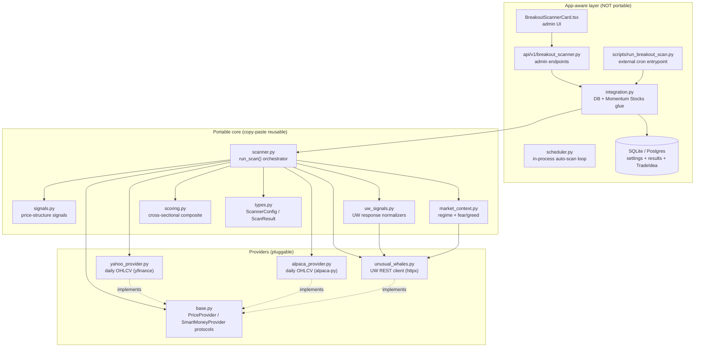
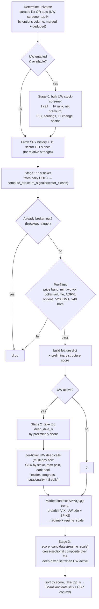
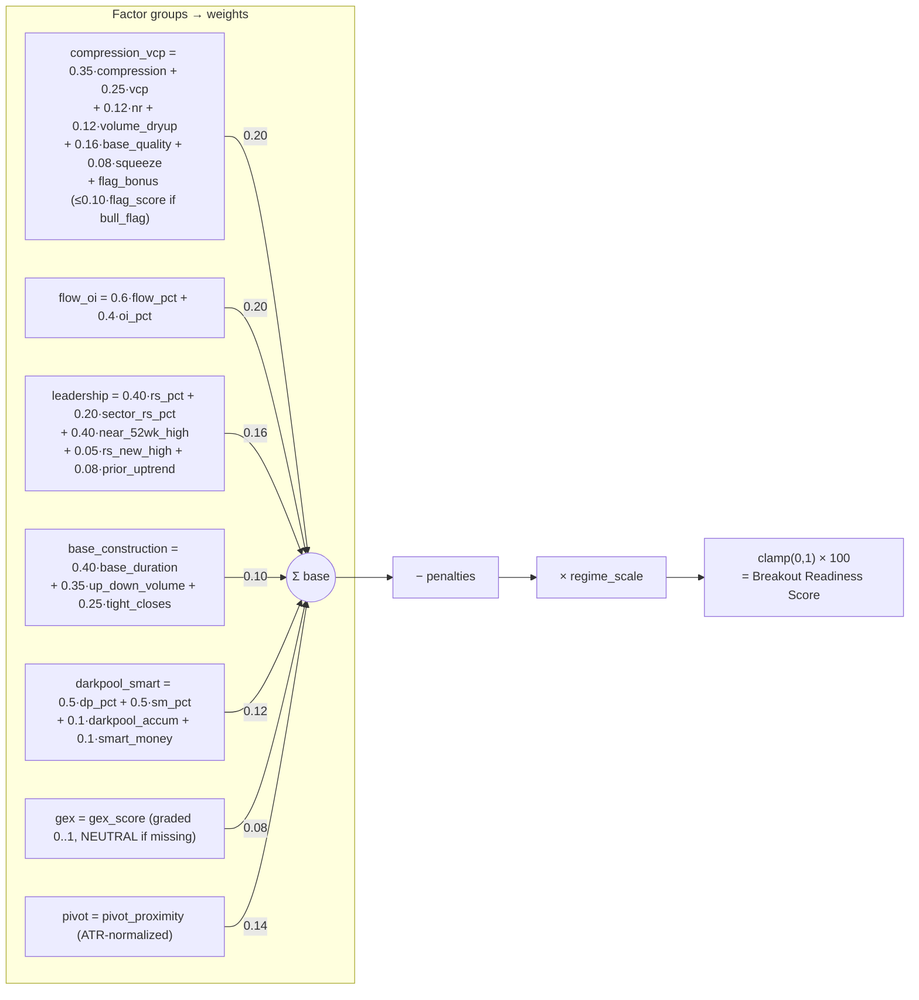
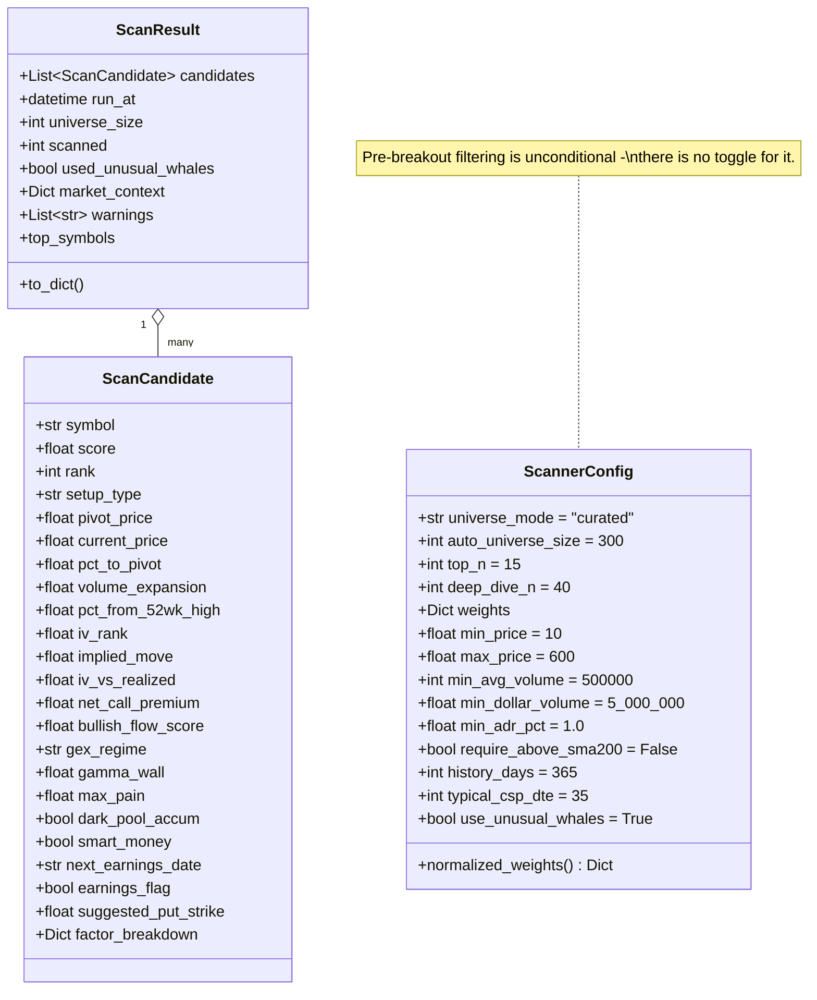
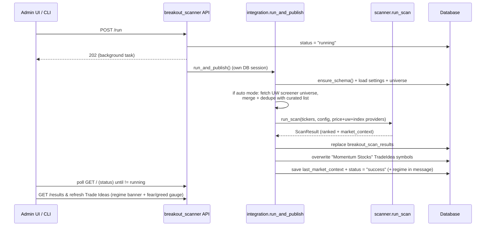
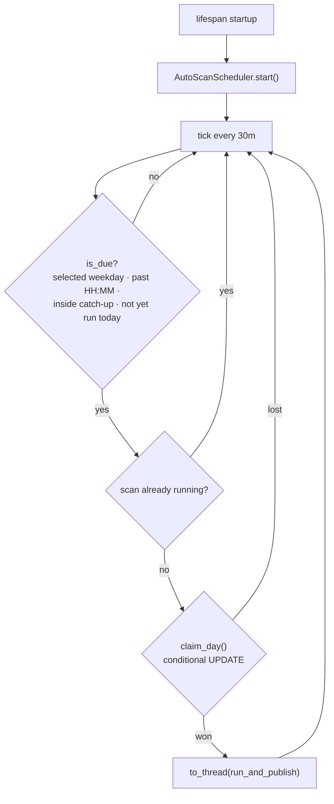
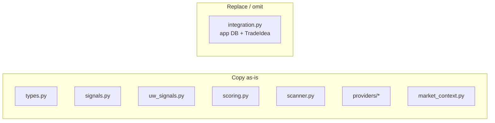
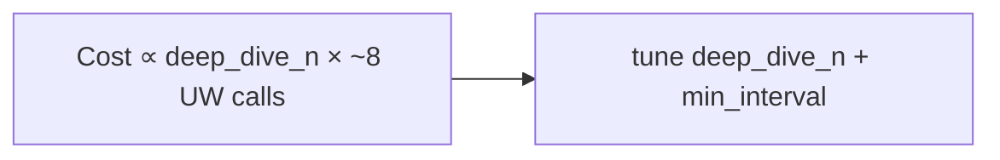

# Breakout Scanner — Architecture & Algorithm

This document explains **how the momentum / breakout scanner works**, **how to reuse it** in
other projects, and serves as **context for future feature work**. For a short usage
overview see `README.md`; this file is the deep reference.

---

## 1. Purpose

Rank a user-defined universe of tickers by a **0–100 Breakout Readiness Score** that
estimates how likely a stock is to break out *soon* (not one already extended). The top
picks are published as the **"Momentum Stocks"** trade idea, primarily to support
**cash-secured put (CSP)** selling on quality names poised to move up.

Design tenets:

- **Pre-breakout only.** A name that has *already* closed above its pivot on expanding
  volume is excluded in Stage 1. The scanner exists to answer "what is about to break
  out?", so a confirmed breakout is out of scope by definition, not merely down-weighted.
  Every factor group therefore measures *readiness*, never confirmation.
- **Leading indicators.** Volatility compression, contraction, base construction,
  relative strength, pivot proximity, and smart-money options flow identify *coiling*
  names. Never lagging triggers (MACD, SMA-cross, raw RSI level).
- **Regime-aware.** A market-context layer (`market_context.py`) condenses the broad tape
  into a 0–100 fear/greed score and a `regime_scale` multiplier so the same setup ranks
  lower in a risk-off tape than a risk-on one. We don't fight the market.
- **Portable core.** Everything except `integration.py` has no app dependencies and can
  be lifted into another project.
- **Graceful degradation.** If Unusual Whales (UW) is unavailable, the scan still runs on
  price structure alone and the UW factor weights are redistributed. Every external input
  (UW endpoint, VIX, index series) degrades to neutral rather than aborting the scan.
  Missing UW factors initialize to `None` (→ neutral 0.5 percentile rank), not `0.0`
  (which would rank dead-last). This applies to the non-ranked `gex` group too, which
  maps a missing score to `NEUTRAL` rather than letting `None or 0.0` collapse it.
- **Transparent scoring.** Every candidate carries a `factor_breakdown` (incl. the applied
  `regime_scale`) so a score can be explained. The admin UI renders this per candidate as
  a per-group value × weight = contribution panel.
- **Order-independent ranking.** `percentile_rank` gives tied values a shared rank, so two
  names with identical flow premium score identically regardless of list position.
- **Intraday-capable.** The scanner can run at any time of day, not just after close.
  `breakout_trigger` checks the prior complete bar's volume when called mid-session so a
  partial bar's low volume doesn't hide a breakout that already happened — which would
  otherwise leak an extended name into the results.

---

## 2. Component architecture



**Dependency rule:** arrows point "downward" only. The core depends on protocols, never on
the app. `integration.py` is the single bridge between the app and the core.

---

## 3. The algorithm

### 3.1 Pipeline (what `run_scan` does)



**Why two UW stages?** Stage 0 is **one cheap bulk call** for the whole universe. Stage 2
is **expensive per-ticker** (multi-day flow, per-strike GEX, max-pain, option-contracts OI,
dark pool, insider, congress, seasonality ≈ 8 calls each), so it only runs for the
strongest `deep_dive_n` structures — this bounds API cost and rate-limit exposure.

**Deep-dive-aware ranking.** When UW is active, only the deep-dived survivors (which have
full smart-money data) are ranked against each other in Stage 3, so a name missing
flow/GEX/dark-pool data can never outrank one that has it.

**Universe modes.**
- **Curated**: admin-maintained list of tickers only.
- **Auto**: fetches the UW stock screener without a ticker filter (top stocks by options
  volume), merges with any curated tickers, and deduplicates. Returns liquid, optionable
  US stocks — exactly the names with UW data coverage. Configured via
  `ScannerConfig.universe_mode` and `auto_universe_size`.

### 3.2 Price-structure signals (`signals.py`)

All pure NumPy; each returns 0..1 unless noted. Computed in
`compute_structure_signals(ohlc, spy_closes, sector_closes)` (requires ≥ 40 bars).

| Signal | Function | Idea | Output |
|--------|----------|------|--------|
| Volatility compression | `bollinger_compression` | Bollinger bandwidth `(2·2σ)/mean`, period 20, over 126-day lookback. Lower current bandwidth vs its own history = coiled spring. | `compression = 1 − percentile`; `squeeze` bool if `bw < 0.75·mean(hist)` or `pctl < 0.15` |
| Range tightness | `nr_tightness` | Avg range of last 7 bars vs prior 30 (NR7 / inside-bar family). | `clip(1.2 − recent/prior)` |
| VCP contraction | `vcp_contraction` | 4 segments × 10 bars; reward monotonically shrinking ranges + tightness of most-recent vs oldest. | 0..1 |
| Volume dry-up | `volume_dryup` | 5-day vs 20-day avg volume; sellers exhausted into the base. | `clip(1.2 − vol5/vol20)` |
| **Volume expansion** | `volume_expansion` | Last-day volume vs 50-day avg. Context only — it feeds `breakout_trigger` and is surfaced in the UI, but is **not** a scored factor (it is a post-breakout signal). | `ratio` + 0..1 score (2× → 1.0) |
| **Breakout trigger** | `breakout_trigger` | Close above pivot on ≥1.5× volume and not over-extended (≤10% above). **Intraday-safe**: also checks the prior complete bar's volume (`vol_ratio_confirmed`) so a mid-session partial bar doesn't suppress a real move. Used purely as the **Stage-1 exclusion filter**. | bool |
| **Base duration** | `base_duration` | How many bars the current consolidation has held inside its band. Institutions cannot accumulate in three days; 10 bars → 0.0, 35+ bars (~7 weeks) → 1.0. | `bars` + 0..1 score |
| **Up/down volume** | `up_down_volume_ratio` | O'Neil accumulation proxy: volume on up days vs down days over 50 bars. Distinguishes quiet accumulation from quiet distribution, which `volume_dryup` cannot. | `ratio` + 0..1 score (2× → 1.0) |
| **Tight closes** | `tight_closes` | Minervini "tight closes": spread of the last 5 closes relative to their mean. A cluster inside ~2% means supply is exhausted. | `spread` % + 0..1 score |
| **Bull flag** | `flag_pattern` | Pole (≥12% advance over 20 bars) + tight flag (≤15% pullback, ≤12% range over 10 bars). Scored by advance size (35%), flag tightness (45%), and volume dry-up during flag (20%). | `flag` bool + `score` 0..1 |
| Relative strength | `relative_strength` | Outperformance vs SPY over 20/40/60d + "rising" bonus; falls back to own momentum if no SPY. | **raw** (can be < 0) |
| **Sector RS** | `relative_strength` (vs sector ETF) | Outperformance vs the stock's own sector ETF (XLK, XLV, XLF, etc.) over the same window. Fetched once per run for all 11 GICS sectors. Missing sector data → `None` → neutral 0.5 percentile (no penalty). | **raw** |
| **RS-line new high** | `rs_line_new_high` | Is the stock/SPY ratio line at a new high (leading price)? | bool |
| **52-week-high proximity** | `fifty_two_week` | Best breakouts emerge near new highs. Proximity peaks within ~15% of the 52wk high. | `near_high` 0..1 + `pct_from_high` |
| **Prior uptrend** | *(inline in `compute_structure_signals`)* | Stock is ≥25% above its 52-week low = Minervini Stage 2 prerequisite. Confirms the trend is established before we bet on a continuation. | bool + `pct_from_52wk_low` |
| **Base quality** | `base_quality` | Shallow base depth + price in the upper portion of the base (accumulation). | 0..1 |
| Pivot proximity | `detect_pivot` + `pivot_proximity` | **Multi-touch pivot**: scans for local swing highs where two highs are within 1.5% of each other (double-top resistance becomes breakout pivot); falls back to rolling 40-bar max when no multi-touch pair is found. Proximity is an **asymmetric Gaussian in ATR units** peaking 0.25 ATR under the pivot, decaying gently below (width 3.0 ATR) and steeply above (width 1.2 ATR). Continuous everywhere, so a name drifting across its pivot never jumps in rank. | 0..1 |
| ATR(14) | `atr` | Used for the suggested CSP strike (~1.5 ATR below price). | raw |
| **ADR%** | `adr_pct` | Average daily range as % of price — tradability/liquidity gate. | raw % |
| **Realized vol** | `realized_vol` | Annualized 20-day realized vol; paired with IV for the IV-vs-realized factor. | raw % |
| Setup label | `classify_setup` | Human tag in priority order: `bull_flag`, `tight_at_pivot`, `squeeze_breakout_setup`, `volatility_squeeze`, `vcp_base`, `flat_base`, `ascending_base`, `consolidation`. | string |

### 3.3 Unusual Whales smart-money signals (`uw_signals.py`)

Defensive normalizers (UW returns many numbers as strings; missing → neutral; never raise).
All per-ticker UW factors initialize to `None` (not `0.0`) so a missing data point maps to
neutral 0.5 in percentile ranking rather than dead-last.

| Factor | Function | Source endpoint | Output |
|--------|----------|-----------------|--------|
| Flow bullishness (multi-day) | `flow_from_ticks` → fallback `flow_bullishness` | `/stock/{t}/net-prem-ticks` (fallback `/stock/{t}/flow-alerts`) | **raw** cumulative net call − net put premium; bid-side puts (selling puts = bullish) are *added* to the score, not subtracted |
| OI accumulation (real) | `oi_accumulation_from_contracts` → fallback `oi_accumulation` | `/stock/{t}/option-contracts` (fallback bulk screener row) | **raw** aggregated call-OI % growth across contracts; fixes the screener `→ 0` degradation |
| Dealer GEX (graded) + gamma wall | `gex_profile` → fallback `gex_regime` | `/stock/{t}/greek-exposure/strike` (fallback `/greek-exposure`) | continuous `score` (short-gamma → high), `regime`, nearest overhead `gamma_wall` strike + `wall_pressure` |
| Max pain | `max_pain_context` | `/stock/{t}/max-pain` | `max_pain` price + distance vs spot (context) |
| IV vs realized | `iv_vs_realized` | screener `implied_move` ÷ `realized_vol` | ratio (>1 rich, <1 cheap options) |
| Dark-pool accumulation | `darkpool_accumulation` | `/darkpool/{t}` | **raw** total block premium; `accum` bool if ≥ $5M |
| Smart money | `smart_money_score` | `/stock/{t}/insider-buy-sells` + `/congress/recent-trades` | **raw** insider net-buy ratio + congress buys; `flag` bool |
| Seasonality edge | `seasonality_edge` | `/seasonality/{t}/monthly` | **raw** avg return for the upcoming month (normalized to %) |
| CSP context | `screener_metrics` | bulk screener row | iv_rank, implied_move, net call/put premium, bullish/bearish premium, P/C, marketcap, price, next_earnings_date |
| Earnings flag | `earnings_within` | screener `next_earnings_date` | bool: earnings within `typical_csp_dte` days |

> The legacy `gex_regime` (coarse `put_gamma − call_gamma` → 0/0.2/1.0) and snapshot
> `flow_bullishness` / screener-row `oi_accumulation` remain as automatic fallbacks when the
> richer per-strike / per-contract / tick endpoints are unavailable.

### 3.4 Market context & regime (`market_context.py`)

Computed once per run (`compute_market_context`) and attached to `ScanResult.market_context`.
Every input is optional and degrades to neutral:

- **Trend:** SPY and QQQ vs 50/200-DMA + 20-day slope (`_index_trend`, 0..1).
- **Breadth:** % of the scanned universe trading above its own 50-DMA (internal proxy).
- **Volatility:** VIX level + 5-day change; UW **SPIKE** treated like VIX.
- **Tape:** UW **market-tide** (net market call vs put premium) → bullish-tape 0..1.

These blend into a **0–100 fear/greed** score and a regime label
(`risk_on ≥ 60 | neutral | risk_off < 40`; a clearly broken SPY tape forces `risk_off`).
The regime yields a smooth **`regime_scale` ∈ [0.70, 1.10]** that multiplies every
candidate's final score (capped ≤ 0.80 in risk-off).

> **Index source:** `run_scan` accepts a separate `index_provider`. The app passes a
> `YahooPriceProvider` for SPY/QQQ/**^VIX** even when the universe uses Alpaca (Alpaca
> can't supply `^VIX`).

### 3.5 Scoring (`scoring.py`)

**Step 1 — normalize.** Raw, unbounded factors are **percentile-ranked across the
ranked set** (`percentile_rank`, **missing → neutral 0.5**, not 0.0) so names merely
lacking a data point aren't pushed to the bottom: `rs_raw`, `sector_rs_raw`,
`flow_bullishness`, `oi_accum`, `darkpool_premium`, `smart_money_score`.
**Tied values share the average of the ranks they span**, so ranking never depends on
input order. Already-0..1 structure signals are used directly.

**Step 2 — seven factor groups (each clamped to 0..1):**



Key formula notes:
- **`flag_bonus`**: `0.10 × flag_score` added to `compression_vcp` when `flag_pattern=True`; quality-scaled so a tight, high-quality flag earns more than a loose one.
- **`leadership`**: split 40% SPY RS + 20% sector RS + 40% near 52wk-high. `prior_uptrend` (+0.08) confirms the stock is ≥25% above its 52-week low (Minervini Stage 2 prerequisite).
- **`base_construction`**: the "has this base actually been built?" group — duration, accumulation, and tightness are each things a shallow multi-day pause cannot fake.
- **`gex`**: the only non-percentile-ranked UW group, so it maps `None → NEUTRAL` directly.

**Step 3 — penalties (subtracted from the 0..1 base):**

- `earnings_flag` → **−0.10** (earnings inside the CSP window = assignment risk).
- bearish flow (`_is_bearish`) → **−0.10** (net put premium ≫ call, or bearish ≫ bullish premium).
- negative seasonality → **− min(0.05, |edge|/100)**.
- **overhead gamma wall** (`gamma_wall_pressure`) → **− min(0.05, pressure·0.05)** (a big
  call-gamma wall just above price acts as resistance).

**Step 4 — finalize.** `score = clamp(clamp(base − penalty, 0, 1) · regime_scale, 0, 1) × 100`,
plus a `factor_breakdown` dict with each group value, the penalty, and `regime_scale`.

> **Weights are configurable.** `ScannerConfig.weights` (defaults in
> `types.DEFAULT_WEIGHTS`) are renormalized to sum to 1.0 via
> `normalized_weights()`, so disabling a group (e.g. setting UW groups to 0)
> automatically reweights the rest.

### 3.6 Preliminary score (deep-dive gate)

Structure-only, cheap, used **only** to rank survivors for Stage-2 UW calls. Every term is
a leading signal — confirmed breakouts never reach this point, so rewarding volume
expansion or a fired trigger here would spend the expensive UW budget on the wrong names:

```
prelim = 0.22·compression + 0.16·vcp + 0.10·nr_tightness
       + 0.08·volume_dryup + 0.18·pivot + 0.10·near_52wk_high
       + 0.06·base_duration + 0.06·up_down_volume + 0.04·tight_closes
       + (0.08 if squeeze) + (0.06 if flag_pattern)
```

Pivot proximity carries the largest single term because, among coiling names, distance to
the pivot is the best cheap predictor of which setup resolves first.

**Allocation:** the top `max(deep_dive_n, top_n)` survivors by prelim score get the
per-ticker UW calls.

---

## 4. Data types (`types.py`)



`DEFAULT_WEIGHTS` (auto-renormalized): `flow_oi 0.20`, `compression_vcp 0.20`,
`leadership 0.16`, `pivot 0.14`, `darkpool_smart 0.12`, `base_construction 0.10`,
`gex 0.08`.

The admin API also returns `effective_weights` — defaults merged with any DB override and
renormalized to 1.0 — so the UI can render true per-factor contributions without
duplicating these constants in TypeScript.

---

## 5. Provider protocols (`providers/base.py`)

Providers are injected so the core stays testable and portable.

```python
class PriceProvider(Protocol):
    def get_price_history(self, symbol: str, days: int = 365) -> list[dict]:
        """Oldest-first list of {date, open, high, low, close, volume}."""

class SmartMoneyProvider(Protocol):
    def is_available(self) -> bool: ...
    def stock_screener(self, tickers: list[str]) -> dict[str, dict]: ...
    def stock_screener_universe(self, max_symbols: int, min_price: float | None) -> list[str]: ...
    def flow_alerts(self, ticker: str) -> list[dict]: ...
    def greek_exposure(self, ticker: str) -> dict: ...
    def darkpool(self, ticker: str) -> list[dict]: ...
    def insider_buy_sells(self, ticker: str) -> dict: ...
    def congress_trades(self, ticker: str) -> list[dict]: ...
    def seasonality(self, ticker: str) -> list[dict]: ...
    # richer factors / market context (callers guard with getattr → optional)
    def greek_exposure_by_strike(self, ticker: str) -> list[dict]: ...
    def max_pain(self, ticker: str): ...
    def net_prem_ticks(self, ticker: str) -> list[dict]: ...
    def option_contracts(self, ticker: str) -> list[dict]: ...
    def market_tide(self) -> list[dict]: ...
    def spike(self): ...
    def economic_calendar(self) -> list[dict]: ...
```

- `YahooPriceProvider` — daily OHLCV via `yfinance`, with an in-process SPY cache.
- `AlpacaPriceProvider` — daily OHLCV via `alpaca-py` (`StockHistoricalDataClient`,
  split/dividend-adjusted, oldest-first, per-instance cache). Preferred when Alpaca keys
  are present; `YahooPriceProvider` is the fallback. (Alpaca can't serve `^VIX`, so the
  market-context index series still comes from Yahoo — see `index_provider` below.)
- `UnusualWhalesProvider` — `httpx` REST client. Per-instance response cache, **429
  handling** (honors `Retry-After`, else exponential backoff capped at 30s), optional
  **`min_interval`** request spacing, and graceful `None`/`[]` on any failure. The newer
  methods (`greek_exposure_by_strike`, `max_pain`, `net_prem_ticks`, `option_contracts`,
  `market_tide`, `spike`, `economic_calendar`, `stock_screener_universe`) are called
  defensively via `getattr` so any provider missing them still works.

> **`run_scan` signature:** `run_scan(tickers, config, price_provider, uw_provider,
> index_provider=None, logger=None)`. `index_provider` (Yahoo in this app) supplies
> SPY/QQQ/^VIX for the market-context layer independently of the universe price provider.

---

## 6. App integration (`integration.py`) & lifecycle



Key behaviors:

- **Enabled gate:** `run_and_publish` refuses to run when `BreakoutScannerSettings.enabled`
  is false, and `POST /run` rejects the request up front so the UI reports it immediately
  instead of queueing a job that will fail.
- **Universe selection:** determined before the scan starts. In auto mode, the UW screener
  is queried without a ticker filter (returns top stocks by options volume); results are
  merged with any curated tickers and deduped. An empty final universe aborts early before
  setting status to "running".
- **Provider selection:** Alpaca daily bars when `ALPACA_API_KEY`/`ALPACA_SECRET_KEY` are
  set (Yahoo otherwise); a Yahoo `index_provider` is always passed for SPY/QQQ/^VIX.
- **Schema self-healing (`ensure_schema`):** the app uses `create_all` (no Alembic), so
  `ensure_schema()` adds any missing columns (`ALTER TABLE`, idempotent, memoized) for
  tables that predate a model change. It runs on app startup (`init_db`), on every
  settings load (`get_or_create_settings`), on results fetch, and before a scan.
- **Market context persisted** to `BreakoutScannerSettings.last_market_context` (JSON) and
  echoed in the run message (`regime: …`).
- **Results are replaced** each run (`_persist_results` deletes prior rows).
- **Trade idea is overwritten** with the new top-N (`set_symbols_list`); an empty result
  set leaves the previous list intact.
- **Status machine:** `idle → running → success | error`. A run stuck in `running` past
  `STALE_RUNNING_MINUTES` (15) is auto-reset on the next status read or run
  (`reset_if_stale`); `reset_status` is the manual override.
- The scan runs as a **background task** (web), on the **built-in schedule**
  (`scheduler.py`, see §6.1), or to completion in the **CLI** (external cron) — it is
  independent of the browser and can be triggered at any time of day.

---

## 6.1 Automatic scan scheduler (`scheduler.py`)

An asyncio loop started from the FastAPI `lifespan` fires the scan on an
admin-configurable wall-clock schedule. There is no job queue or scheduler library in
this app and it deploys as a single uvicorn process, so a loop is the whole mechanism.
The schedule lives in the same singleton settings row as the rest of the scanner config,
so it is editable from the admin UI with no redeploy.

**Manual runs are unaffected.** `POST /run` works whether or not the schedule is on.



| Setting | Column | Default | Meaning |
|---|---|---|---|
| Auto scan | `auto_scan_enabled` | `false` | Opt-in master switch for the schedule |
| Time | `auto_scan_time` | `"16:30"` | Local `HH:MM` wall clock |
| Timezone | `auto_scan_timezone` | `"America/New_York"` | IANA zone name |
| Days | `auto_scan_days` | `"0,1,2,3,4"` | CSV of Python `weekday()` numbers (Mon=0) |
| — | `last_auto_run_date` | `null` | `YYYY-MM-DD` in the configured zone; the claim key |
| — | `last_auto_run_at` | `null` | UTC timestamp of the last automatic trigger |

Key behaviors:

- **Default is 30 minutes after the close.** 16:30 America/New_York is late enough for the
  daily bar to settle, which matters because nearly every signal reads `closes[-1]` as a
  completed close and `volume_dryup` is biased upward by a partial bar.
- **Wall-clock, not interval.** Storing `HH:MM` + IANA zone keeps the slot at 16:30 local
  across DST rather than drifting by an hour twice a year.
- **Opt-in.** `auto_scan_enabled` defaults to `false` so upgrading an existing deployment
  never silently starts spending API quota. `ensure_schema` backfills the new columns on
  the existing row so an upgraded DB behaves identically to a fresh one.
- **Exactly once per day.** `claim_day` writes `last_auto_run_date` with a conditional
  `UPDATE ... WHERE last_auto_run_date <> :day` and only proceeds when it matched a row.
  A slow tick, a restart, or a second worker process therefore cannot double-fire.
- **Catch-up window.** A slot missed because the process was down still runs when the
  process returns, but only within `CATCHUP_WINDOW` (4h). Past that the day is skipped
  rather than producing a surprise scan at midnight.
- **Manual runs win.** A tick that finds `last_run_status == "running"` defers without
  claiming the slot, so it retries on the next tick instead of burning the day.
- **The event loop is never blocked.** `run_and_publish` is synchronous and takes minutes,
  so it is dispatched via `asyncio.to_thread`; the API keeps serving during a scan.
- **Both switches must be on.** `enabled` (master) gates the schedule as well as manual
  runs; the UI warns when the schedule is on but the scanner is disabled.
- **Editing the schedule re-arms today** only when the new time has not yet passed
  (`_rearm_if_slot_still_ahead`). Moving 16:30 → 20:00 at 17:00 runs tonight; moving
  16:30 → 16:45 after both passed does not trigger a duplicate catch-up scan.
- **`next_auto_run_at` is resolved server-side** and returned by `GET /` so the admin UI
  shows a countdown without reimplementing the weekday/catch-up/already-ran logic.
- **Market holidays are not skipped** — there is no market calendar in this app. A holiday
  scan is harmless: the last daily bar is unchanged, so it reproduces the prior ranking.
- **The external cron path still works** and is now redundant. Use one or the other; both
  enabled is safe (the status check and claim prevent overlap) but pointless.

---

## 7. Reusing the module in another project

**Copy** `breakout_scanner/` **except `integration.py`** (the only app-coupled file —
it imports this app's SQLAlchemy models and config).



Minimal usage:

```python
from breakout_scanner import run_scan, ScannerConfig
from breakout_scanner.providers import YahooPriceProvider, UnusualWhalesProvider

result = run_scan(
    tickers=["AAPL", "NVDA", "PLTR"],
    config=ScannerConfig(top_n=15, use_unusual_whales=True),
    price_provider=YahooPriceProvider(),
    uw_provider=UnusualWhalesProvider(api_key="...", min_interval=0.2),  # optional
)
for c in result.candidates:
    print(c.rank, c.symbol, c.score, c.setup_type, c.iv_rank)
```

Auto-universe mode (no curated list needed):

```python
config = ScannerConfig(
    universe_mode="auto",
    auto_universe_size=300,
    top_n=15,
    use_unusual_whales=True,
)
# pass an empty tickers list; integration.py builds the universe from UW
```

Requirements: `numpy`, plus `yfinance` (default price provider) and `httpx` (UW provider).
To integrate persistence in your own app, write a thin equivalent of `integration.py`
against your storage.

**Bring your own data:** implement `PriceProvider` (e.g. wrap your existing OHLCV source)
and optionally `SmartMoneyProvider`. As long as the return shapes match the protocols, the
core is unchanged.

---

## 8. Extending the scanner (future feature playbook)

### Add a new **price-structure** signal
1. Implement a pure function in `signals.py` returning 0..1 (or raw).
2. Add its value to the dict returned by `compute_structure_signals`.
3. In `scanner.py`, copy it into the per-ticker `feat` dict.
4. In `scoring.py`, either fold it into an existing group formula or create a new group +
   add a weight to `types.DEFAULT_WEIGHTS` (raw factors: percentile-rank first).

### Add a new **Unusual Whales** signal
1. Add the endpoint method to `UnusualWhalesProvider` (+ `SmartMoneyProvider` protocol).
2. Add a normalizer in `uw_signals.py` (defensive parsing, neutral on missing).
3. Call it in the Stage-2 deep-dive loop in `scanner.py`; store on `feat`.
4. Wire into a scoring group/weight as above. Surface on `ScanCandidate` +
   `BreakoutScanResult` if it should appear in the UI.

### Add a new **data provider**
Implement `PriceProvider` or `SmartMoneyProvider` and pass it to `run_scan`. No core
changes needed.

### Change weighting / thresholds
Adjust `ScannerConfig` (or the DB `BreakoutScannerSettings.weights` JSON, editable from
the admin UI's **Factor weights** panel). Weights are auto-renormalized, so partial
overrides are safe.

### Checklist when adding a factor that should persist/display
- [ ] `signals.py` / `uw_signals.py` — compute it (return `None`, never `0.0`, on missing)
- [ ] `scanner.py` — add to `feat` (and Stage-2 call if UW)
- [ ] `scoring.py` — group + weight (+ `DEFAULT_WEIGHTS`)
- [ ] `types.ScanCandidate` — new field (+ `to_dict`)
- [ ] `models.BreakoutScanResult` — column (+ `to_dict`) and `integration._persist_results`
- [ ] `integration._RESULT_COLUMNS` / `_SETTINGS_COLUMNS` — add the column for
      `ensure_schema()` so existing DBs get the `ALTER TABLE` (no Alembic in this app)
- [ ] frontend `types` + `BreakoutScannerCard` table/badges
- [ ] `FACTOR_GROUPS` in `BreakoutScannerCard.tsx` if it is a new scoring group, so it
      appears in the breakdown panel and the weights editor
- [ ] `tests/test_breakout_scanner.py` — a directional test with synthetic data

### Removing a DB column
There is no Alembic. Columns added by `ensure_schema()` arrive via `ALTER TABLE` and are
nullable, so dropping them from the model is safe. A column created by the original
`create_all` may be `NOT NULL`; verify with `PRAGMA table_info` before removing it from the
model, or inserts that omit it will fail on existing databases.

---

## 9. Known limitations & tuning notes

- **OI accumulation** now prefers real per-contract call-OI growth
  (`/stock/{t}/option-contracts`), falling back to the bulk screener row (then 0) when
  contracts are unavailable.
- **GEX** is graded continuously from per-strike exposure (`/greek-exposure/strike`) with
  overhead gamma-wall detection; the coarse `put_gamma − call_gamma` proxy remains a
  fallback. The short-gamma→bullish assumption is still a simplification (negative gamma
  amplifies moves in *both* directions).
- **Market context / VIX:** `^VIX` is only fetched from the Yahoo `index_provider`; on a
  Yahoo-less setup VIX (and its fear/greed contribution) is simply omitted, and the regime
  is computed from the remaining inputs. UW SPIKE/market-tide require a UW key.
- **Sector RS** requires UW data for sector metadata (the screener returns a `sector` field
  per ticker). In curated-only mode without UW, `sector_rs_raw` is `None` → neutral 0.5
  percentile so stocks are not penalized for missing sector data.
- **Intraday partial bar:** volume for the current incomplete bar is excluded from
  breakout-trigger decisions; the scanner instead uses `vol_ratio_confirmed` (prior
  complete bar vs the 50-bar avg excluding today). Since the trigger is now the exclusion
  filter, a false positive here silently drops a valid candidate rather than merely
  mis-scoring it.
- **Seasonality** is a deliberately small penalty-only signal.
- **Rate limits:** Stage-2 is the cost driver (~8 calls × `deep_dive_n`). Tune
  `deep_dive_n` and `UnusualWhalesProvider(min_interval=...)` to your UW plan.
- **History requirement:** tickers with < 40 daily bars are skipped; 52-week-high and
  realized-vol signals are most meaningful with ≥ ~252 bars. Bull flag requires ≥ 31 bars
  (20-bar pole + 10-bar flag) to evaluate.
- **CSP strike** is a heuristic (~1.5 ATR below price), not an options-chain optimization.
- **Base-duration band** is anchored on the last 10 bars, so a base that widens gradually
  can read as shorter than a chart-reader would call it.
- **No backtest/validation harness** — scores aren't measured against realized forward
  returns; weights are expert priors, not fit. The `factor_breakdown` panel in the admin
  UI is the only feedback loop today, and it is qualitative.


